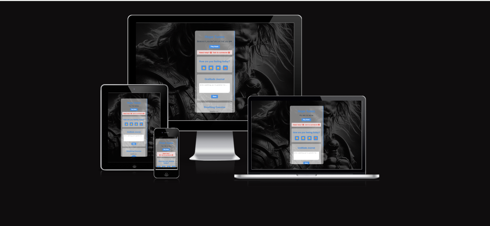

# Hope Tunes : 
[Here is the link](https://purohit1999.github.io/Hope-Tunes/)



## 🎵 Harmonizing Mental Wellness Through Technology

Welcome to Hope Tunes—a compassionate web application designed to nurture mental well-being through a symphony of soothing music, uplifting affirmations, intuitive mood tracking, reflective gratitude journaling, and calming breathing exercises. Our mission is to provide a digital sanctuary for those seeking solace, relaxation, and emotional support.  

##  💔❤️‍🩹 Suicides in England 2022 :#### [Here is Link](https://www.samaritans.org/about-samaritans/research-policy/suicide-facts-and-figures/latest-suicide-data/)  

## ✨ Features  

### 🖼️ Imagery 
- Images created from free Bing AI tool [Here Link](https://www.bing.com/images/create/)

### 🌟 Affirmations
- Curated positive affirmations to inspire and encourage
- Dynamic display with periodic rotation for continuous motivation

### 🎶 Music Player
- Streamlined audio player with carefully selected tracks
- Create a serene atmosphere to complement your journey to well-being

### 😊 Mood Tracker
- Intuitive emoji-based mood logging system
- Persistent mood history stored locally for personal reflection

### 📔 Gratitude Journal
- Private space to document and cherish moments of gratitude
- Secure local storage to preserve your personal growth journey

### 🧘 Breathing Exercise
- Guided breathing sessions with visual cues
- Customizable durations to fit your schedule

### 🖼️ Dynamic Background
- Ever-changing visuals to keep your environment fresh and engaging

### 🆘 Mental Health Resources
- Quick access to professional mental health support and information

## 🚀 Getting Started

### Prerequisites
- Modern web browser (Chrome, Firefox, Safari, Edge)
- Internet connection for initial setup and external resources

### Installation

1. Clone the repository:
   ```
   git clone https://github.com/Purohit1999/hopetunes.git
   ```
2. Navigate to the project directory:
   ```
   cd hopetunes
   ```
3. Open `index.html` in your preferred browser

## 🖱️ Usage

1. Launch the application
2. Toggle music playback with the "Play/Pause" button
3. Reflect on the displayed affirmation
4. Log your current emotional state
5. Pen your gratitude entries
6. Engage in a calming breathing exercise
7. Access additional mental health resources as needed

## 🧪 Testing

### Frameworks
- **Mocha**: JavaScript test runner
- **Chai**: Assertion library
- **Sinon**: Mocking and stubbing utility

### Running Tests

1. Ensure Node.js and npm are installed
2. Install dependencies:
   ```
   npm install
   ```
3. Execute test suite:
   ```
   npm test
   ```

## 🤝 Contributing

We welcome contributions! Here's how you can help:

1. Fork the repository
2. Create a feature branch: `git checkout -b feature/AmazingFeature`
3. Commit your changes: `git commit -m 'Add some AmazingFeature'`
4. Push to the branch: `git push origin feature/AmazingFeature`
5. Open a pull request

Please read [CONTRIBUTING.md](CONTRIBUTING.md) for details on our code of conduct and the process for submitting pull requests.

## 📜 License

This project is licensed under the MIT License - see the [LICENSE](LICENSE) file for details.

## 🙏 Acknowledgments

- Inspired by the global need for accessible mental health tools
- Affirmations and visuals curated by mental health professionals
- Music: "Daylight" by David Kushner, Drake Livingston, Edison Boon Eason, Hayden Hubers, Jeremy Fedryk, Joshua Bruce Williams
- EKC https://www.ekcgroup.ac.uk/
- Code Institue https://codeinstitute.net/full-stack-software-development-diploma/
  
## 📞 Support

If you're experiencing a mental health crisis, please reach out for help:
- National Suicide Prevention Lifeline: 1-800-273-8255
- Crisis Text Line: Text HOME to 741741

Remember, you're not alone. We're here to support your journey to better mental health.

---

Made with ❤️ by Param Purohit
